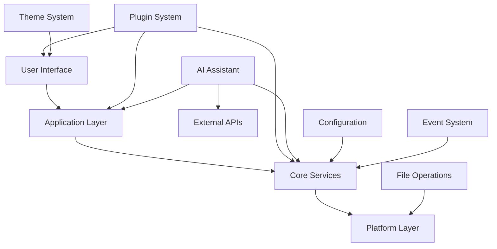
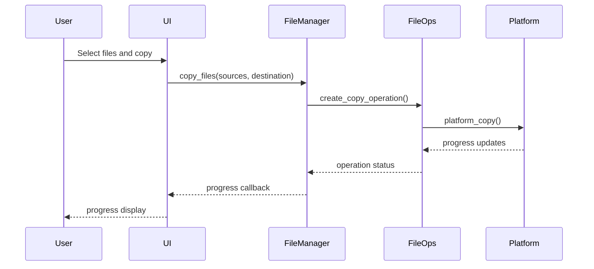
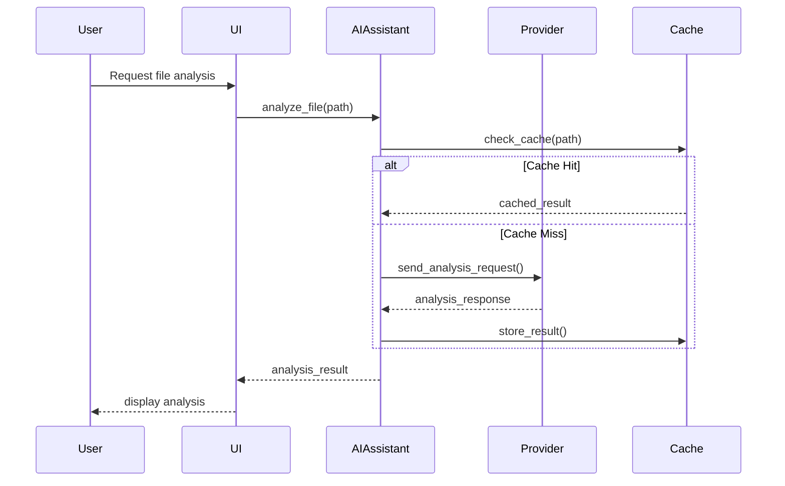
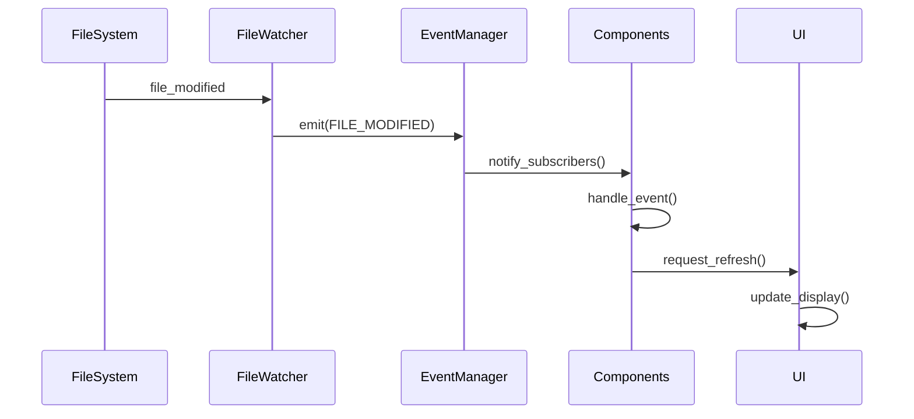
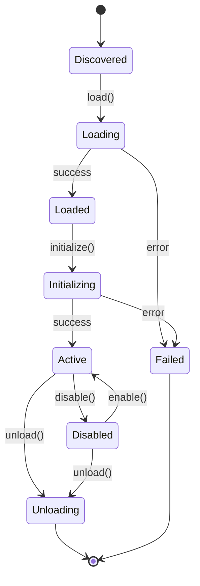

# LaxyFile Architecture Documentation

This document provides a comprehensive overview of LaxyFile's architecture, design decisions, and implementation details.

## Table of Contents

1. [System Overview](#system-overview)
2. [Core Architecture](#core-architecture)
3. [Component Design](#component-design)
4. [Data Flow](#data-flow)
5. [Plugin Architecture](#plugin-architecture)
6. [AI Integration](#ai-integration)
7. [Performance Considerations](#performance-considerations)
8. [Security Architecture](#security-architecture)
9. [Cross-Platform Design](#cross-platform-design)
10. [Future Architecture](#future-architecture)

## System Overview

LaxyFile is designed as a modular, extensible file manager that combines traditional file management with AI-powered capabilities. The architecture follows modern software engineering principles including separation of concerns, dependency injection, and event-driven design.

### High-Level Architecture

```
┌─────────────────────────────────────────────────────────────┐
│                    LaxyFile Application                     │
├─────────────────────────────────────────────────────────────┤
│  User Interface Layer (Rich TUI)                           │
│  ├── SuperFile UI    ├── Theme System    ├── Input Handler │
├─────────────────────────────────────────────────────────────┤
│  Application Layer                                          │
│  ├── File Manager    ├── AI Assistant    ├── Plugin System │
├─────────────────────────────────────────────────────────────┤
│  Core Services Layer                                        │
│  ├── File Operations ├── Configuration   ├── Event System  │
├─────────────────────────────────────────────────────────────┤
│  Platform Abstraction Layer                                │
│  ├── File System     ├── OS Integration  ├── Network├─────────────────────────────────────────────────────────────┤
│  External Dependencies                                      │
│  ├── Rich (TUI)      ├── AI APIs         ├── System APIs   │
└─────────────────────────────────────────────────────────────┘
```

### Design Principles

1. **Modularity**: Each component has a single responsibility and well-defined interfaces
2. **Extensibility**: Plugin system allows adding new functionality without core changes
3. **Performance**: Async operations, caching, and lazy loading for responsiveness
4. **Cross-Platform**: Abstraction layers handle platform-specific differences
5. **User-Centric**: UI and UX designed for efficiency and ease of use
6. **AI-First**: AI capabilities integrated throughout the system, not bolted on

## Core Architecture

### Layered Architecture

LaxyFile uses a layered architecture with clear separation between concerns:

#### 1. User Interface Layer

- **Responsibility**: User interaction, display, input handling
- **Components**: SuperFile UI, Theme System, Input Handler
- **Technology**: Rich library for terminal UI

#### 2. Application Layer

- **Responsibility**: Business logic, orchestration, workflows
- **Components**: File Manager, AI Assistant, Plugin System
- **Technology**: Python async/await, dependency injection

#### 3. Core Services Layer

- **Responsibility**: Shared services, utilities, infrastructure
- **Components**: File Operations, Configuration, Event System
- **Technology**: Async I/O, caching, serialization

#### 4. Platform Abstraction Layer

- **Responsibility**: OS-specific operations, hardware abstraction
- **Components**: File System, OS Integration, Network
- **Technology**: Platform-specific implementations

### Component Interaction



## Component Design

### File Manager Component

The file manager is the core component responsible for file system operations.

```python
class AdvancedFileManager:
    """Advanced file manager with caching and async operations"""

    def __init__(self, config: Config):
        self.config = config
        self.cache = LRUCache(config.get('cache_size', 1000))
        self.file_watcher = FileWatcher()
        self.performance_tracker = PerformanceTracker()

    async def list_directory(self, path: Path) -> List[FileInfo]:
        """List directory with caching and performance tracking"""
        # Implementation with caching, async I/O, and error handling
        pass
```

**Design Decisions:**

- **Async Operations**: All I/O operations are asynchronous to prevent UI blocking
- **Caching Strategy**: LRU cache for file metadata with configurable size
- **Performance Tracking**: Built-in performance monitoring and optimization
- **Error Handling**: Comprehensive error handling with user-friendly messages

### AI Assistant Component

The AI assistant integrates multiple AI providers and provides intelligent file management.

```python
class AdvancedAIAssistant:
    """AI assistant with multi-provider support"""

    def __init__(self, config: Config):
        self.config = config
        self.providers = self._initialize_providers()
        self.cache = AIResponseCache()
        self.context_manager = ContextManager()

    async def analyze_file(self, file_path: Path) -> AnalysisResult:
        """Analyze file with AI"""
        # Implementation with provider selection, caching, and error handling
        pass
```

**Design Decisions:**

- **Multi-Provider Support**: Support for OpenRouter, Ollama, GPT4All, and custom providers
- **Response Caching**: Cache AI responses to reduce API calls and improve performance
- **Context Management**: Maintain conversation context for better AI interactions
- **Fallback Mechanisms**: Graceful degradation when AI services are unavailable

### Plugin System Component

The plugin system provides extensibility through a well-defined API.

```python
class PluginManager:
    """Plugin management system"""

    def __init__(self, config: Config):
        self.config = config
        self.plugins = {}
        self.plugin_loader = PluginLoader()
        self.dependency_resolver = DependencyResolver()

    def load_plugin(self, plugin_path: Path) -> bool:
        """Load and initialize plugin"""
        # Implementation with dependency resolution and error handling
        pass
```

**Design Decisions:**

- **Dynamic Loading**: Plugins loaded at runtime without application restart
- **Dependency Resolution**: Automatic handling of plugin dependencies
- **Sandboxing**: Security measures to isolate plugin execution
- **API Versioning**: Backward compatibility for plugin APIs

### UI System Component

The UI system provides a modern, responsive interface inspired by SuperFile.

```python
class SuperFileUI:
    """SuperFile-inspired user interface"""

    def __init__(self, theme_manager: ThemeManager, console: Console):
        self.theme_manager = theme_manager
        self.console = console
        self.layout = self._create_layout()
        self.input_handler = InputHandler()

    def render(self) -> None:
        """Render the complete UI"""
        # Implementation with responsive layout and theme support
        pass
```

**Design Decisions:**

- **Rich Library**: Uses Rich for advanced terminal UI capabilities
- **Responsive Design**: Adapts to different terminal sizes automatically
- **Theme System**: Comprehensive theming with SuperFile-inspired defaults
- **Keyboard-First**: Optimized for keyboard navigation and shortcuts

## Data Flow

### File Operation Flow



### AI Analysis Flow



### Event Flow



## Plugin Architecture

### Plugin Lifecycle



### Plugin API Design

The plugin API is designed with these principles:

1. **Capability-Based**: Plugins declare their capabilities
2. **Event-Driven**: Plugins respond to system events
3. **Dependency Injection**: Core services injected into plugins
4. **Versioned APIs**: Backward compatibility maintained

```python
class BasePlugin:
    """Base class for all plugins"""

    # Plugin metadata
    name: str
    version: str
    capabilities: List[PluginCapability]

    def __init__(self, config: Dict[str, Any]):
        self.config = config
        self.logger = PluginLogger(self.name)
        self.event_manager = None  # Injected
        self.ui_api = None        # Injected
        self.file_api = None      # Injected

    def initialize(self) -> bool:
        """Initialize plugin"""
        pass

    def cleanup(self) -> None:
        """Cleanup plugin resources"""
        pass
```

### Plugin Security

Security measures for the plugin system:

1. **Sandboxing**: Plugins run in restricted environment
2. **Permission System**: Explicit permissions for sensitive operations
3. **Code Signing**: Verify plugin authenticity
4. **API Restrictions**: Limited access to system resources

## AI Integration

### AI Provider Architecture

```python
class AIProvider:
    """Abstract base class for AI providers"""

    async def send_request(self, prompt: str, context: Dict) -> str:
        """Send request to AI provider"""
        pass

    def get_capabilities(self) -> List[str]:
        """Get provider capabilities"""
        pass

    def get_cost_estimate(self, prompt: str) -> float:
        """Estimate request cost"""
        pass
```

### Supported Providers

1. **OpenRouter**: Cloud-based AI with multiple models
2. **Ollama**: Local AI models for privacy
3. **GPT4All**: Offline AI capabilities
4. **Custom**: User-defined AI endpoints

### AI Context Management

The AI system maintains context across interactions:

```python
class ContextManager:
    """Manages AI conversation context"""

    def __init__(self):
        self.contexts = {}
        self.max_context_length = 4000

    def add_context(self, session_id: str, message: str) -> None:
        """Add message to context"""
        pass

    def get_context(self, session_id: str) -> str:
        """Get formatted context"""
        pass

    def trim_context(self, session_id: str) -> None:
        """Trim context to fit limits"""
        pass
```

## Performance Considerations

### Caching Strategy

LaxyFile implements multi-level caching:

1. **File Metadata Cache**: LRU cache for file information
2. **Directory Listing Cache**: Cache directory contents
3. **AI Response Cache**: Cache AI analysis results
4. **Theme Cache**: Cache rendered theme elements

```python
class CacheManager:
    """Multi-level cache management"""

    def __init__(self, config: Config):
        self.file_cache = LRUCache(config.get('file_cache_size'))
        self.ai_cache = TTLCache(config.get('ai_cache_size'), ttl=3600)
        self.theme_cache = WeakValueDict()

    def get_file_info(self, path: Path) -> Optional[FileInfo]:
        """Get cached file info"""
        pass
```

### Async Operations

All I/O operations are asynchronous to maintain UI responsiveness:

```python
async def list_directory_async(path: Path) -> List[FileInfo]:
    """Asynchronous directory listing"""
    loop = asyncio.get_event_loop()

    # Use thread pool for I/O operations
    with ThreadPoolExecutor() as executor:
        files = await loop.run_in_executor(executor, os.listdir, path)

    # Process files asynchronously
    tasks = [get_file_info_async(path / f) for f in files]
    return await asyncio.gather(*tasks)
```

### Memory Management

Memory optimization strategies:

1. **Lazy Loading**: Load data only when needed
2. **Weak References**: Prevent memory leaks in caches
3. **Garbage Collection**: Explicit cleanup of large objects
4. **Memory Monitoring**: Track memory usage and optimize

### Performance Monitoring

Built-in performance monitoring:

```python
class PerformanceTracker:
    """Track and analyze performance metrics"""

    def __init__(self):
        self.metrics = defaultdict(list)
        self.start_times = {}

    def start_operation(self, operation: str) -> str:
        """Start tracking operation"""
        operation_id = f"{operation}_{time.time()}"
        self.start_times[operation_id] = time.time()
        return operation_id

    def end_operation(self, operation_id: str) -> float:
        """End tracking and return duration"""
        if operation_id in self.start_times:
            duration = time.time() - self.start_times[operation_id]
            operation_name = operation_id.split('_')[0]
            self.metrics[operation_name].append(duration)
            del self.start_times[operation_id]
            return duration
        return 0.0
```

## Security Architecture

### Security Principles

1. **Least Privilege**: Components have minimal required permissions
2. **Input Validation**: All user input validated and sanitized
3. **Secure Defaults**: Security-first default configurations
4. **Audit Logging**: Security events logged for analysis

### File System Security

```python
class SecureFileOperations:
    """Secure file operations with permission checking"""

    def __init__(self, config: Config):
        self.allowed_paths = config.get('allowed_paths', [])
        self.restricted_paths = config.get('restricted_paths', [])

    def check_path_access(self, path: Path, operation: str) -> bool:
        """Check if path access is allowed"""
        # Implementation with path validation and permission checking
        pass

    async def secure_copy(self, source: Path, dest: Path) -> bool:
        """Secure file copy with validation"""
        if not self.check_path_access(source, 'read'):
            raise PermissionError(f"Read access denied: {source}")

        if not self.check_path_access(dest, 'write'):
            raise PermissionError(f"Write access denied: {dest}")

        # Perform secure copy operation
        pass
```

### AI Security

Security measures for AI integration:

1. **Data Sanitization**: Remove sensitive data before AI processing
2. **Response Validation**: Validate AI responses for safety
3. **Rate Limiting**: Prevent AI API abuse
4. **Local Processing**: Option for offline AI processing

```python
class AISecurityManager:
    """Security manager for AI operations"""

    def __init__(self):
        self.sensitive_patterns = [
            r'\b\d{4}[-\s]?\d{4}[-\s]?\d{4}[-\s]?\d{4}\b',  # Credit cards
            r'\b\d{3}-\d{2}-\d{4}\b',  # SSN
            r'\b[A-Za-z0-9._%+-]+@[A-Za-z0-9.-]+\.[A-Z|a-z]{2,}\b'  # Email
        ]

    def sanitize_content(self, content: str) -> str:
        """Remove sensitive information from content"""
        sanitized = content
        for pattern in self.sensitive_patterns:
            sanitized = re.sub(pattern, '[REDACTED]', sanitized)
        return sanitized
```

## Cross-Platform Design

### Platform Abstraction

LaxyFile uses a platform abstraction layer to handle OS differences:

```python
class PlatformInterface:
    """Abstract interface for platform-specific operations"""

    def get_file_icon(self, file_path: Path) -> str:
        """Get platform-specific file icon"""
        pass

    def open_file_with_default_app(self, file_path: Path) -> bool:
        """Open file with default application"""
        pass

    def move_to_trash(self, file_path: Path) -> bool:
        """Move file to platform trash/recycle bin"""
        pass

    def get_file_associations(self, extension: str) -> List[str]:
        """Get file associations for extension"""
        pass
```

### Platform Implementations

```python
class WindowsPlatform(PlatformInterface):
    """Windows-specific implementation"""

    def move_to_trash(self, file_path: Path) -> bool:
        """Move to Windows Recycle Bin"""
        import send2trash
        send2trash.send2trash(str(file_path))
        return True

class MacOSPlatform(PlatformInterface):
    """macOS-specific implementation"""

    def move_to_trash(self, file_path: Path) -> bool:
        """Move to macOS Trash"""
        import subprocess
        subprocess.run(['osascript', '-e',
                       f'tell app "Finder" to delete POSIX file "{file_path}"'])
        return True

class LinuxPlatform(PlatformInterface):
    """Linux-specific implementation"""

    def move_to_trash(self, file_path: Path) -> bool:
        """Move to Linux trash"""
        import subprocess
        subprocess.run(['gio', 'trash', str(file_path)])
        return True
```

### Configuration Management

Platform-specific configuration handling:

```python
class PlatformConfig:
    """Platform-specific configuration"""

    @staticmethod
    def get_config_dir() -> Path:
        """Get platform-specific config directory"""
        if sys.platform == 'win32':
            return Path(os.environ['APPDATA']) / 'LaxyFile'
        elif sys.platform == 'darwin':
            return Path.home() / 'Library' / 'Application Support' / 'LaxyFile'
        else:  # Linux and others
            return Path.home() / '.config' / 'laxyfile'

    @staticmethod
    def get_cache_dir() -> Path:
        """Get platform-specific cache directory"""
        if sys.platform == 'win32':
            return Path(os.environ['LOCALAPPDATA']) / 'LaxyFile' / 'Cache'
        elif sys.platform == 'darwin':
            return Path.home() / 'Library' / 'Caches' / 'LaxyFile'
        else:  # Linux and others
            return Path.home() / '.cache' / 'laxyfile'
```

## Future Architecture

### Planned Enhancements

1. **Distributed Architecture**: Support for remote file systems and cloud storage
2. **Microservices**: Break down monolithic components into services
3. **WebAssembly Plugins**: Support for WASM-based plugins
4. **Real-time Collaboration**: Multi-user file management capabilities

### Scalability Considerations

1. **Horizontal Scaling**: Support for multiple LaxyFile instances
2. **Load Balancing**: Distribute AI requests across providers
3. **Caching Layers**: Distributed caching for better performance
4. **Database Integration**: Optional database for metadata storage

### Technology Evolution

1. **Modern Python Features**: Adopt new Python language features
2. **Alternative UI Frameworks**: Consider web-based or native UIs
3. **AI Model Integration**: Direct integration with AI model frameworks
4. **Cloud-Native Features**: Kubernetes deployment and scaling

## Design Patterns Used

### Architectural Patterns

1. **Layered Architecture**: Clear separation of concerns
2. **Plugin Architecture**: Extensibility through plugins
3. **Event-Driven Architecture**: Loose coupling through events
4. **Repository Pattern**: Data access abstraction

### Design Patterns

1. **Factory Pattern**: Create platform-specific implementations
2. **Observer Pattern**: Event system implementation
3. **Strategy Pattern**: AI provider selection
4. **Decorator Pattern**: Plugin capability enhancement
5. **Singleton Pattern**: Configuration and cache management
6. **Command Pattern**: File operations and undo functionality

### Code Organization

```
laxyfile/
├── core/                 # Core components and interfaces
│   ├── __init__.py
│   ├── config.py        # Configuration management
│   ├── types.py         # Type definitions
│   ├── interfaces.py    # Abstract interfaces
│   └── exceptions.py    # Custom exceptions
├── ui/                  # User interface components
│   ├── __init__.py
│   ├── superfile_ui.py  # Main UI implementation
│   ├── theme.py         # Theme system
│   └── panels.py        # UI panels
├── operations/          # File operations
│   ├── __init__.py
│   ├── file_ops.py      # File operations
│   └── batch_ops.py     # Batch operations
├── ai/                  # AI integration
│   ├── __init__.py
│   ├── advanced_assistant.py  # AI assistant
│   ├── providers/       # AI providers
│   └── analyzers/       # File analyzers
├── plugins/             # Plugin system
│   ├── __init__.py
│   ├── base_plugin.py   # Base plugin class
│   ├── plugin_manager.py # Plugin management
│   └── examples/        # Example plugins
└── utils/               # Utilities
    ├── __init__.py
    ├── cache.py         # Caching utilities
    ├── async_utils.py   # Async utilities
    └── platform.py      # Platform utilities
```

This architecture provides a solid foundation for LaxyFile's current functionality while allowing for future growth and enhancement. The modular design ensures maintainability, the plugin system provides extensibility, and the performance optimizations ensure a responsive user experience.
